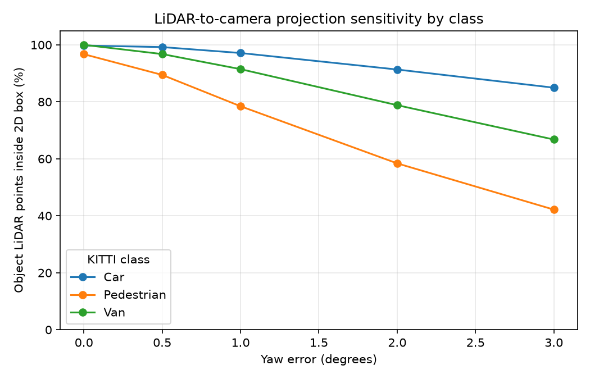
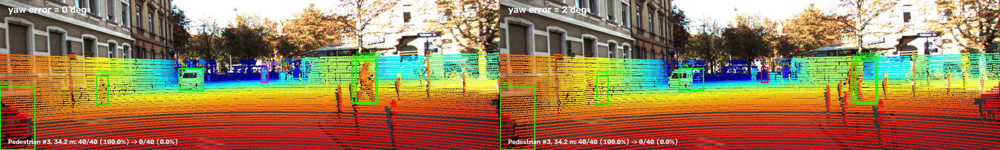

# Báo cáo Day 6: Độ nhạy của projection với lệch yaw

- **Họ tên:** Nguyễn Hoàng Cường
- **MSSV:** 2A202602473
- **Lớp:** AI20K-T4
- **Link repo:** https://github.com/5cuong/K4-Track4-Day06-NguyenHoangCuong-2A202602473-3D-From-Point-Clouds
- **Topic:** A — Kiểm tra calibration LiDAR-camera bằng projection
- **Dataset:** data/kitti_mini
- **Các frame đã dùng:** 000008, 000011, 000049; demo khoảng cách: 000019, 000011, 000004

## 1. Claim

Trên frame 000011, lệch yaw 1° làm tỉ lệ điểm LiDAR của các vật thể nằm trong 2D box giảm từ 99.45% xuống 77.44% (giảm 22.01 điểm phần trăm), trong khi frame nhiều xe 000008 giảm từ 99.63% xuống 98.62% đối với class Car.

## 2. Evidence

| Frame / class | Yaw 0° | 0.5° | 1° | 2° | 3° |
|---|---:|---:|---:|---:|---:|
| 000008 / Car | 99.63% | 99.57% | 98.62% | 94.81% | 90.98% |
| 000011 / tất cả class | 99.45% | 91.88% | 77.44% | 45.44% | 21.23% |
| 000049 / tất cả class | 99.25% | 97.46% | 93.50% | 84.74% | 74.32% |



[PDF slide demo](DAY06_DEMO.pdf)

Ảnh demo chiếu điểm LiDAR lên camera ở ba khoảng cách: [gần, frame 000019](../results/figures/overlay_000019_r0.0_p0.0_y0.0_t0.0_0.0_0.0.png), [giữa, frame 000011](../results/figures/overlay_000011_r0.0_p0.0_y0.0_t0.0_0.0_0.0.png), [xa, frame 000004](../results/figures/overlay_000004_r0.0_p0.0_y0.0_t0.0_0.0_0.0.png).

CSV `results/yaw_perturb_sweep.csv` có 70 dòng, chia theo frame, yaw, class và khoảng cách. Sweep deterministic, chạy lại cho cùng kết quả. `hit_ratio = hits / object_points`; mẫu số là điểm thuộc 3D box đồng thời chiếu vào ảnh, nên thay đổi theo yaw (frame 000011: 725 điểm ở 0° và 656 ở 1°).

## 3. Failure case



- **Trường hợp:** KITTI frame 000011, người đi bộ #3 ở khoảng cách 34.2 m, lệch yaw 2°.
- **Quan sát:** điểm nằm trong 2D box giảm từ 40/40 (100%) xuống 0/40 (0%); tỉ lệ tổng các class trong frame giảm từ 99.45% xuống 45.44%.
- **Nguyên nhân:** phép quay extrinsic làm vị trí chiếu trượt ngang; ở khoảng cách này người đi bộ chỉ chiếm một vùng ảnh hẹp.
- **Lớp debug:** Geometry — extrinsic LiDAR-camera không còn khớp.
- **Phát hiện khi chạy thật:** theo dõi tỉ lệ điểm chiếu khớp với vùng phát hiện camera theo class/khoảng cách; cảnh báo nếu dưới 90% trong ba cửa sổ kiểm tra liên tiếp.

## 4. Khuyến nghị triển khai

Với xe giao hàng tự hành chạy trong khu đô thị, chạy kiểm tra alignment lúc khởi động và sau sự kiện va chạm/rung mạnh; dùng các vật thể tĩnh và vùng phát hiện camera để đối chiếu với điểm LiDAR đã chiếu. Ghi log tỉ lệ khớp theo class, khoảng cách, yaw ước lượng và nhiệt độ gá cảm biến; cảnh báo nếu tỉ lệ thấp hơn 90% trong ba lần kiểm tra liên tục. Cách kiểm tra chủ động tốn thêm thời gian xử lý và cần đủ vật thể quan sát được, nên có thể chạy lúc xe dừng thay vì mọi frame khi xe đang chạy.

## 5. Cách chạy lại

Chạy lần đầu trong PowerShell từ thư mục gốc để tạo môi trường và cài thư viện; các lệnh tiếp theo tạo lại bằng chứng:

```powershell
python --version
python -m venv .venv
.\.venv\Scripts\Activate.ps1
python -m pip install -r requirements.txt
python tools/verify_data.py --data-root data/kitti_mini
python tools/verify_data.py --data-root data/nuscenes_mini_subset
python -m starter.data_health --data-root data/synthetic
python -m starter.data_health --data-root data/kitti_mini --out results/data_health_kitti.csv
python -m starter.data_health --data-root data/nuscenes_mini_subset --out results/data_health_nusc.csv
python -m src.test_projection
python -m starter.projection --data-root data/synthetic --frame 000000
python -m starter.projection --data-root data/synthetic --frame 000000 --yaw-deg 2
python -m starter.projection --data-root data/kitti_mini --frame 000019
python -m starter.projection --data-root data/kitti_mini --frame 000011
python -m starter.projection --data-root data/kitti_mini --frame 000004
python -m starter.projection --data-root data/nuscenes_mini_subset --frame scene-0103_010
python -m src.exp_yaw_sweep --data-root data/kitti_mini --frames 000008 000011 000049
python -m src.plot_yaw_sweep
python -m src.make_failure_figure
python -m src.make_demo_slides
python tools/check_submission.py
```

## 6. Khai báo sử dụng AI

| Công cụ | Dùng cho việc gì | Bạn đã kiểm chứng thế nào |
|---|---|---|
| OpenAI Codex | Đọc hướng dẫn, cài hai hàm TODO projection, viết script benchmark/biểu đồ/ảnh failure và biên tập report | Chạy `src.test_projection`, đối chiếu ba số `inside_image` với guide, kiểm tra số liệu CSV và chạy lại sweep cho kết quả giống hệt |
