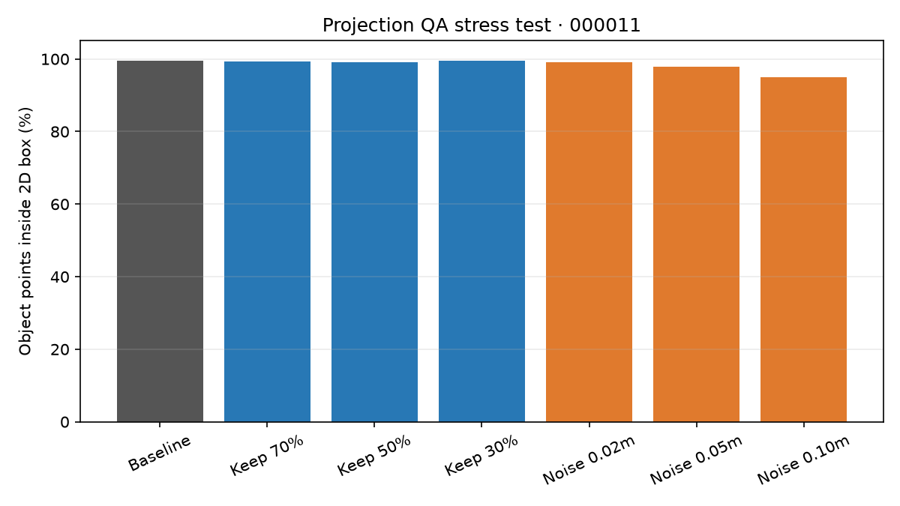
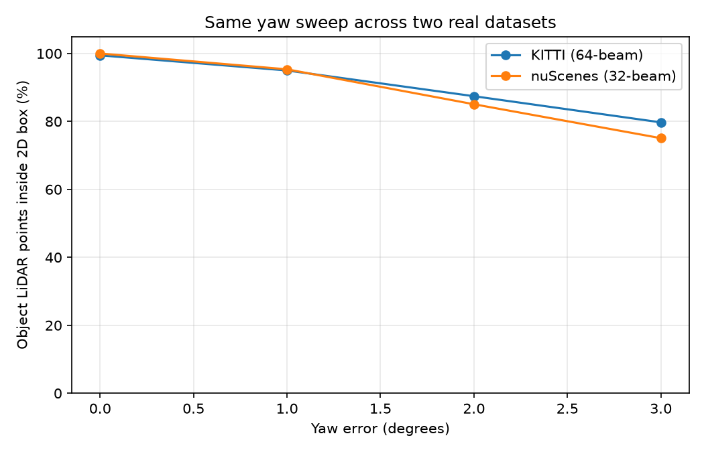

# Báo cáo Day 6: Độ nhạy của projection với lệch yaw

- **Họ tên:** Nguyễn Hoàng Cường
- **MSSV:** 2A202602473
- **Lớp:** AI20K-T4
- **Link repo:** https://github.com/5cuong/K4-Track4-Day06-NguyenHoangCuong-2A202602473-3D-From-Point-Clouds
- **Topic:** A — Kiểm tra calibration LiDAR-camera bằng projection
- **Dataset:** data/kitti_mini; B5: data/nuscenes_mini_subset
- **Các frame đã dùng:** KITTI: 000008, 000011, 000049; demo: 000019, 000011, 000004; nuScenes B5: scene-0103_010, scene-0103_020, scene-1094_010

## 1. Claim

Trên frame 000011, lệch yaw 1° làm tỉ lệ điểm LiDAR của các vật thể nằm trong 2D box giảm từ 99.45% xuống 77.44% (giảm 22.01 điểm phần trăm), trong khi frame nhiều xe 000008 giảm từ 99.63% xuống 98.62% đối với class Car.

## 2. Evidence

| Frame / class | Yaw 0° | 0.5° | 1° | 2° | 3° |
|---|---:|---:|---:|---:|---:|
| 000008 / Car | 99.63% | 99.57% | 98.62% | 94.81% | 90.98% |
| 000011 / tất cả class | 99.45% | 91.88% | 77.44% | 45.44% | 21.23% |
| 000049 / tất cả class | 99.25% | 97.46% | 93.50% | 84.74% | 74.32% |


[PDF slide demo](DAY06_DEMO.pdf)

Ảnh demo chiếu điểm LiDAR lên camera ở ba khoảng cách: [gần, frame 000019](../results/figures/overlay_000019_r0.0_p0.0_y0.0_t0.0_0.0_0.0.png), [giữa, frame 000011](../results/figures/overlay_000011_r0.0_p0.0_y0.0_t0.0_0.0_0.0.png), [xa, frame 000004](../results/figures/overlay_000004_r0.0_p0.0_y0.0_t0.0_0.0_0.0.png).

CSV `results/yaw_perturb_sweep.csv` có 70 dòng, chia theo frame, yaw, class và khoảng cách. Sweep deterministic, chạy lại cho cùng kết quả. `hit_ratio = hits / object_points`; mẫu số là điểm thuộc 3D box đồng thời chiếu vào ảnh, nên thay đổi theo yaw (frame 000011: 725 điểm ở 0° và 656 ở 1°).

### Bonus

**[B2] Stress test:** trên frame 000011, chạy random dropout (giữ 70/50/30%, seed 0) và Gaussian noise (σ = 0.02/0.05/0.10 m). Tỉ lệ hit baseline là 99.45%; noise 0.10 m còn 95.08%. Dropout 30% giữ hit ratio 99.49% nhưng số điểm in-image giảm từ 725 xuống 197, nên cần đọc cả hai chỉ số.



**[B3] Latency:** đo projection trên frame 000011 21 lần, bỏ warm-up đầu và lấy 20 lần còn lại: p50 = 15.54 ms, p95 = 17.14 ms. Phần cứng: Intel Core i9-13900H, RAM 15.6 GB; đo CPU, không dùng GPU. Dữ liệu từng lần chạy ở `results/latency_projection.csv`.

**[B4] Tool dùng lại:** `src/exp_yaw_sweep.py` có argparse, mặc định hợp lý và `--help`; có thể đổi dataset, frame, mức yaw và đường dẫn CSV. Kiểm tra bằng `python -m src.exp_yaw_sweep --help`.

**[B5] Hai dataset thật:** cùng mức yaw trên KITTI (000008, 000011, 000049) và nuScenes (scene-0103_010, scene-0103_020, scene-1094_010); metric gộp có trọng số theo số điểm.

| Dataset | 0° | 1° | 2° | 3° |
|---|---:|---:|---:|---:|
| KITTI (3 frame) | 99.45% | 95.00% | 87.43% | 79.73% |
| nuScenes (3 frame) | 100.00% | 95.34% | 85.06% | 75.08% |



nuScenes có LiDAR 32 beam, khoảng 34.7 nghìn điểm/frame và ảnh 1600×900; KITTI có 64 beam, khoảng 108–126 nghìn điểm/frame và ảnh 1242×375. Tỉ lệ theo yaw khá gần, nhưng scene/nhãn không ghép cặp nên không thể quy phần chênh lệch cho riêng sensor; nuScenes được dùng ego-motion compensation mặc định.
## 3. Failure case


- **Trường hợp:** KITTI frame 000011, người đi bộ #3 ở khoảng cách 34.2 m, lệch yaw 2°.
- **Quan sát:** điểm nằm trong 2D box giảm từ 40/40 (100%) xuống 0/40 (0%); tỉ lệ tổng các class trong frame giảm từ 99.45% xuống 45.44%.
- **Nguyên nhân:** phép quay extrinsic làm vị trí chiếu trượt ngang; ở khoảng cách này người đi bộ chỉ chiếm một vùng ảnh hẹp.
- **Lớp debug:** Geometry — extrinsic LiDAR-camera không còn khớp.
- **Phát hiện khi chạy thật:** theo dõi tỉ lệ điểm chiếu khớp với vùng phát hiện camera theo class/khoảng cách; cảnh báo nếu dưới 90% trong ba cửa sổ kiểm tra liên tiếp.

## 4. Khuyến nghị triển khai

Với xe giao hàng tự hành chạy trong khu đô thị, chạy kiểm tra alignment lúc khởi động và sau sự kiện va chạm/rung mạnh; dùng các vật thể tĩnh và vùng phát hiện camera để đối chiếu với điểm LiDAR đã chiếu. Ghi log tỉ lệ khớp theo class, khoảng cách, yaw ước lượng và nhiệt độ gá cảm biến; cảnh báo nếu tỉ lệ thấp hơn 90% trong ba lần kiểm tra liên tục. Cách kiểm tra chủ động tốn thêm thời gian xử lý và cần đủ vật thể quan sát được, nên có thể chạy lúc xe dừng thay vì mọi frame khi xe đang chạy.

## 5. Cách chạy lại

Chạy lần đầu trong PowerShell từ thư mục gốc để tạo môi trường và cài thư viện; các lệnh tiếp theo tạo lại bằng chứng:

```powershell
python --version
python -m venv .venv
.\.venv\Scripts\Activate.ps1
python -m pip install -r requirements.txt
python tools/verify_data.py --data-root data/kitti_mini
python tools/verify_data.py --data-root data/nuscenes_mini_subset
python -m starter.data_health --data-root data/synthetic
python -m starter.data_health --data-root data/kitti_mini --out results/data_health_kitti.csv
python -m starter.data_health --data-root data/nuscenes_mini_subset --out results/data_health_nusc.csv
python -m src.test_projection
python -m starter.projection --data-root data/synthetic --frame 000000
python -m starter.projection --data-root data/synthetic --frame 000000 --yaw-deg 2
python -m starter.projection --data-root data/kitti_mini --frame 000019
python -m starter.projection --data-root data/kitti_mini --frame 000011
python -m starter.projection --data-root data/kitti_mini --frame 000004
python -m starter.projection --data-root data/nuscenes_mini_subset --frame scene-0103_010
python -m src.exp_yaw_sweep --help
python -m src.exp_yaw_sweep --data-root data/kitti_mini --frames 000008 000011 000049
python -m src.exp_degradation --data-root data/kitti_mini --frame 000011 --seed 0
python -m src.bench_projection_latency --data-root data/kitti_mini --frame 000011 --runs 21
python -m src.exp_yaw_sweep --data-root data/kitti_mini --frames 000008 000011 000049 --yaw-levels 0 1 2 3 --out results/bonus_kitti_yaw.csv
python -m src.exp_yaw_sweep --data-root data/nuscenes_mini_subset --frames scene-0103_010 scene-0103_020 scene-1094_010 --yaw-levels 0 1 2 3 --out results/bonus_nusc_yaw.csv
python -m src.plot_bonus_yaw_compare
python -m src.plot_yaw_sweep
python -m src.make_failure_figure
python -m src.make_demo_slides
python tools/check_submission.py
```

## 6. Khai báo sử dụng AI

| Công cụ | Dùng cho việc gì                                                    | Đã kiểm chứng thế nào                                                                                                                                                                                                                                                                                                                                                                                                                                                                                                                                                 |
|---|---------------------------------------------------------------------|-----------------------------------------------------------------------------------------------------------------------------------------------------------------------------------------------------------------------------------------------------------------------------------------------------------------------------------------------------------------------------------------------------------------------------------------------------------------------------------------------------------------------------------------------------------------------|
| OpenAI Codex | Đọc và giải thích hướng dẫn lab; hỗ trợ chỉnh hai hàm projection và  xây dựng script thí nghiệm, biểu đồ, ảnh failure.| Chạy self-test projection; kiểm tra checksum KITTI/nuScenes; chạy lại yaw sweep và so sánh CSV; chạy tools/check_submission.py. Chọn Topic A và dữ liệu/frame; cài và kiểm tra môi trường, dữ liệu; triển khai phép chiếu LiDAR lên ảnh và tạo overlay; chạy sweep yaw và stress test dropout/nhiễu; đo latency và so sánh KITTI với nuScenes; phân tích failure case; viết claim, evidence, khuyến nghị triển khai và hướng dẫn chạy lại. Học viên chịu trách nhiệm hiểu, rà soát và trình bày các kết quả đã nộp. |
