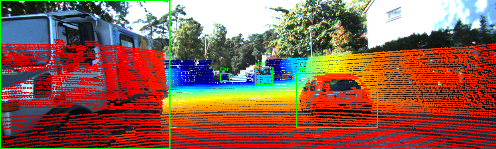

# Báo cáo Day 6: Độ nhạy của projection với lệch yaw

- **Họ tên:** Nguyễn Hoàng Cường
- **MSSV:** 2A202602473
- **Lớp:** AI20K-T4
- **Link repo:** https://github.com/5cuong/K4-Track4-Day06-NguyenHoangCuong-2A202602473-3D-From-Point-Clouds
- **Topic:** A — Kiểm tra calibration LiDAR-camera bằng projection
- **Dataset:** data/kitti_mini
- **Các frame đã dùng:** 000008, 000011, 000049; demo khoảng cách: 000019, 000011, 000004

## 1. Claim

Trên frame 000011, lệch yaw 1° làm tỉ lệ điểm LiDAR của các vật thể nằm trong 2D box giảm từ 99.45% xuống 77.44% (giảm 22.01 điểm phần trăm), trong khi frame nhiều xe 000008 giảm từ 99.63% xuống 98.62% đối với class Car.

## 2. Evidence

CP2 demo: LiDAR points projected onto camera images at three KITTI ranges.




## 3. Failure case

Nêu khi nào hệ thống hoặc phương pháp fail, vì sao fail, và liên hệ tới lớp nào trong 6 lớp debug: I/O, Geometry, Time, Preprocess, Model, Metric.


[ĐIỀN]

## 4. Khuyến nghị nếu triển khai thật

Use-case cụ thể (ADAS / robot / drone), trade-off và bước tiếp theo.

[ĐIỀN]

## 5. Cách chạy lại

Các lệnh tái tạo lại toàn bộ kết quả từ repo sạch.

```bash
[ĐIỀN]
```

## 6. Khai báo sử dụng AI

Ghi rõ đã dùng công cụ AI nào, dùng vào việc gì, và bạn đã tự kiểm chứng kết quả đó bằng cách nào. Nếu không dùng AI, ghi "Không sử dụng". Xem quy định ở `RULES.md` mục 2.

| Công cụ | Dùng cho việc gì | Bạn đã kiểm chứng thế nào |
|---|---|---|
| [ĐIỀN] | | |
